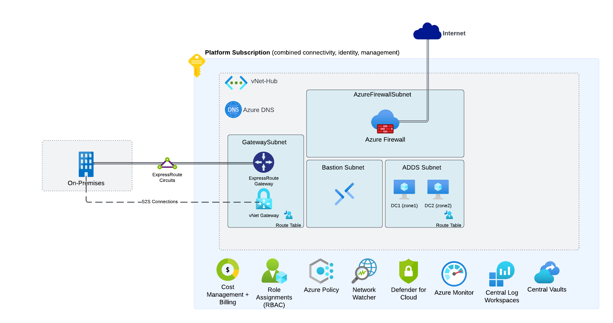

# Deploy Azure Platform Landing Zone Resources
This deployment will create the resources necessary to deploy the platform landing zone into a subscription. This deployment adheres to our best practice and deployment standards
- Resource Groups required for all resources
- Hub vNet with a gateway subnet, firewall subnet, bastion subnet, and Active Directory Domain Services subnet
- vNet Gateway for S2S connectivity (optional)
- vNet Gateway for ExpressRoute connectivity (optional)
- Route tables
- Bastion instance
- Zoned pair of Domain Controllers
- MicroAge managed configurations for all resources

## Pre-requisites

- Azure Tenant and Subscription and Client Information

## Deployment

The easiest method is to configure the deployment via the provided blue buttons as they include the custom UI for configuring the options.  However, you can also utilize PowerShell and the Azure CLI.

## Architecture Diagram

